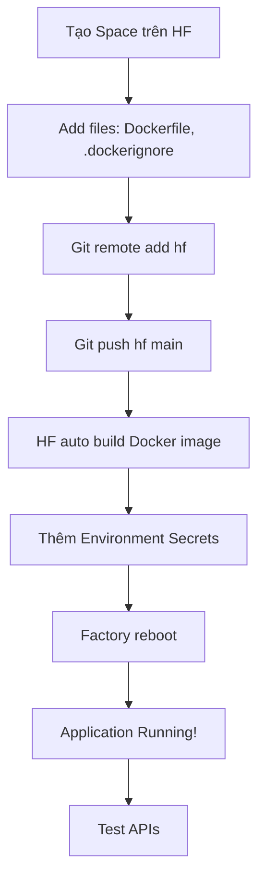

# 🚀 DEPLOY BACKEND LÊN HUGGING FACE SPACES - HƯỚNG DẪN CHI TIẾT

## 📝 MỤC LỤC
1. [Yêu cầu trước khi bắt đầu](#yêu-cầu)
2. [Tạo Space trên Hugging Face](#bước-1-tạo-space)
3. [Cấu hình project trong VSCode](#bước-2-cấu-hình-project)
4. [Push code lên Hugging Face](#bước-3-push-code)
5. [Cấu hình Environment Variables](#bước-4-cấu-hình-secrets)
6. [Kiểm tra deployment](#bước-5-kiểm-tra)
7. [Troubleshooting](#troubleshooting)

---

## 🎯 YÊU CẦU

### ✅ Cài đặt:
- Git (https://git-scm.com/downloads)
- VSCode (https://code.visualstudio.com)
- Java 17 JDK
- Maven 3.9+

### ✅ Tài khoản:
- Hugging Face account (https://huggingface.co/join)
- Database MySQL đã setup (Azure/AWS/Railway/PlanetScale)
- Azure Storage account (cho blob storage)
- Azure Service Bus (cho AI caption queue)
- Gmail account với App Password (cho email OTP)

### ✅ Thông tin cần chuẩn bị:

```env
# Database
DB_URL=jdbc:mysql://your-mysql-host:3306/locketai
DB_USERNAME=admin
DB_PASSWORD=your-secure-password

# JWT
JWT_SECRET=locketaiSecretKey2024MinLength32Chars!
JWT_EXPIRATION=86400000

# Email (Gmail SMTP)
MAIL_USERNAME=your-email@gmail.com
MAIL_PASSWORD=your-gmail-app-password
MAIL_FROM=your-email@gmail.com
MAIL_FROM_NAME=LocketAI

# Azure Storage
AZURE_STORAGE_CONNECTION_STRING=DefaultEndpointsProtocol=https;AccountName=your_storage;AccountKey=...;EndpointSuffix=core.windows.net

# Azure Service Bus
AZURE_SERVICEBUS_CONNECTION_STRING=Endpoint=sb://your-servicebus.servicebus.windows.net/;SharedAccessKeyName=RootManageSharedAccessKey;SharedAccessKey=...
AZURE_QUEUE_NAME=caption_jobs

# AI Callback
AI_CAPTION_CALLBACK_SECRET=your-callback-secret-key

# Server
SERVER_PORT=7860
```

---

## 🚀 BƯỚC 1: TẠO SPACE TRÊN HUGGING FACE

### 1.1 Đăng nhập và tạo Space

1. Vào https://huggingface.co và đăng nhập
2. Click avatar → **New Space** (hoặc vào trực tiếp https://huggingface.co/new-space)

### 1.2 Điền thông tin Space

```yaml
Owner: [your-username]
Space name: pbl6-backend-prod
License: Apache 2.0
SDK: Docker ⚠️ QUAN TRỌNG: Chọn Docker, không phải Gradio/Streamlit
Space Hardware: CPU basic - 2 vCPU, 16GB RAM (free tier)
Visibility: Public (hoặc Private nếu muốn)
```

3. Click **Create Space**

### 1.3 Lấy Git URL

Sau khi tạo, copy Git URL:
```bash
https://huggingface.co/spaces/[your-username]/pbl6-backend-prod
```

**🔑 Tạo Access Token:**
1. Vào Settings → Access Tokens (https://huggingface.co/settings/tokens)
2. Click **New token**
3. Name: `vscode-deploy`
4. Role: **Write** ⚠️ Quan trọng
5. Copy token (chỉ hiện 1 lần!)

---

## 🛠️ BƯỚC 2: CẤU HÌNH PROJECT TRONG VSCODE

### 2.1 Mở project trong VSCode

```bash
# Mở terminal trong VSCode (Ctrl + `)
cd "d:\Ky 1 nam 4 2025 - 2026\PBL6\backend"
```

### 2.2 Kiểm tra files đã tạo

Đảm bảo có 3 files sau trong thư mục `backend/`:
- ✅ `Dockerfile` (đã tạo)
- ✅ `.dockerignore` (đã tạo)
- ✅ `README.md` (đã cập nhật với Hugging Face header)

### 2.3 Test build local (Optional nhưng nên làm)

```bash
# Build JAR
mvn clean package -DskipTests

# Check JAR đã build
ls target/*.jar

# Test Docker build local
docker build -t pbl6-backend-prod .
```

---

## 📤 BƯỚC 3: PUSH CODE LÊN HUGGING FACE

### 3.1 Khởi tạo Git repo (nếu chưa có)

```bash
# Kiểm tra xem đã có git chưa
git status

# Nếu chưa có, khởi tạo:
git init
git branch -M main
```

### 3.2 Add Hugging Face remote

```bash
# Thêm Hugging Face remote
git remote add hf https://huggingface.co/spaces/[your-username]/pbl6-backend-prod

# Kiểm tra
git remote -v
```

**Lưu ý:** Thay `[your-username]` bằng username Hugging Face của bạn

### 3.3 Commit và push

```bash
# Stage all files
git add Dockerfile .dockerignore README.md pom.xml src/

# Commit
git commit -m "Initial deployment to Hugging Face Spaces"

# Push lần đầu (sẽ hỏi username + token)
git push hf main

# Nếu bị lỗi, force push:
git push hf main --force
```

**🔐 Khi push, nhập:**
- Username: `[your-username]`
- Password: `[access-token-đã-tạo-ở-bước-1.3]` ⚠️ KHÔNG phải mật khẩu Hugging Face

### 3.4 Lưu credentials (để không phải nhập lại)

**Windows (PowerShell):**
```powershell
git config --global credential.helper wincred
```

**Mac/Linux:**
```bash
git config --global credential.helper store
```

---

## 🔐 BƯỚC 4: CẤU HÌNH ENVIRONMENT VARIABLES (SECRETS)

### 4.1 Vào Settings của Space

1. Truy cập Space: `https://huggingface.co/spaces/[your-username]/pbl6-backend-prod`
2. Click tab **Settings**
3. Scroll xuống phần **Repository secrets**

### 4.2 Thêm từng secret

Click **Add a secret** và thêm từng cặp key-value:

| Variable Name | Example Value | Mô tả |
|---------------|---------------|-------|
| `DB_URL` | `jdbc:mysql://db.example.com:3306/locketai` | MySQL connection string |
| `DB_USERNAME` | `admin` | Database username |
| `DB_PASSWORD` | `StrongPassword123!` | Database password |
| `JWT_SECRET` | `locketaiSecretKey2024Min32Chars!` | JWT signing key (≥32 chars) |
| `JWT_EXPIRATION` | `86400000` | Token expiration (ms) |
| `MAIL_USERNAME` | `locketai@gmail.com` | Gmail address |
| `MAIL_PASSWORD` | `abcd efgh ijkl mnop` | Gmail App Password (16 chars) |
| `MAIL_FROM` | `locketai@gmail.com` | Sender email |
| `MAIL_FROM_NAME` | `LocketAI` | Sender name |
| `AZURE_STORAGE_CONNECTION_STRING` | `DefaultEndpointsProtocol=https;...` | Azure Blob connection |
| `AZURE_SERVICEBUS_CONNECTION_STRING` | `Endpoint=sb://...` | Azure Service Bus |
| `AZURE_QUEUE_NAME` | `caption_jobs` | Queue name |
| `AI_CAPTION_CALLBACK_SECRET` | `CallbackSecret123!` | AI callback secret |
| `SERVER_PORT` | `7860` | Port (mặc định) |

**⚠️ LƯU Ý:**
- `MAIL_PASSWORD`: Phải là **App Password**, không phải mật khẩu Gmail thường
  - Tạo tại: https://myaccount.google.com/apppasswords
- `JWT_SECRET`: Tối thiểu 32 ký tự
- Sau khi thêm xong, click **Save** ở cuối trang

### 4.3 Cách lấy Gmail App Password

1. Vào https://myaccount.google.com/security
2. Enable **2-Step Verification** (bắt buộc)
3. Vào https://myaccount.google.com/apppasswords
4. Chọn app: **Mail**, device: **Other (Custom name)** → nhập "LocketAI"
5. Click **Generate** → Copy mật khẩu 16 ký tự (dạng: `abcd efgh ijkl mnop`)

---

## ✅ BƯỚC 5: KIỂM TRA DEPLOYMENT

### 5.1 Xem build logs

1. Quay lại Space: `https://huggingface.co/spaces/[your-username]/pbl6-backend-prod`
2. Sẽ thấy status: **Building** → Đợi 5-10 phút
3. Click **Logs** để xem quá trình build

**Build stages:**
```
1. Downloading base images
2. Maven downloading dependencies
3. Building JAR file
4. Creating runtime image
5. Starting application
```

### 5.2 Kiểm tra application running

Khi thấy log:
```
Started BackendApplication in X.XXX seconds
```

→ Backend đã chạy thành công! 🎉

### 5.3 Test API endpoints

**Health check:**
```bash
curl https://[your-username]-pbl6-backend-prod.hf.space/actuator/health
```

**Response mong đợi:**
```json
{
  "status": "UP"
}
```

**Test register:**
```bash
curl -X POST https://[your-username]-pbl6-backend-prod.hf.space/api/auth/register \
  -H "Content-Type: application/json" \
  -d '{
    "username": "testuser",
    "email": "test@example.com",
    "password": "Test123!",
    "fullName": "Test User"
  }'
```

### 5.4 Lấy public URL

URL backend của bạn:
```
https://[your-username]-pbl6-backend-prod.hf.space
```

Sử dụng URL này trong:
- Mobile app (Flutter): `apiBaseUrl`
- Admin web (React): `VITE_API_URL`
- AI Server (Python): `callback_url`

---

## 🐛 TROUBLESHOOTING

### ❌ Build failed: "Could not resolve dependencies"

**Nguyên nhân:** Maven không tải được dependencies

**Giải pháp:**
```bash
# Kiểm tra pom.xml có đúng không
mvn clean install -DskipTests

# Nếu OK local, commit lại
git add pom.xml
git commit -m "Fix dependencies"
git push hf main
```

### ❌ Application crashes on startup

**Kiểm tra:**
1. Vào **Logs** tab
2. Tìm dòng lỗi màu đỏ
3. Thường do:
   - ❌ Database connection failed → Check `DB_URL`, `DB_USERNAME`, `DB_PASSWORD`
   - ❌ JWT secret too short → Check `JWT_SECRET` ≥ 32 chars
   - ❌ Missing required env var → Check tất cả secrets đã thêm chưa

**Sửa:**
1. Vào **Settings** → **Repository secrets**
2. Sửa giá trị secret sai
3. Click **Factory reboot** để restart

### ❌ Port 7860 already in use

**Nguyên nhân:** Dockerfile expose sai port

**Giải pháp:**
```dockerfile
# Trong Dockerfile, đảm bảo:
EXPOSE 7860
ENV SERVER_PORT=7860
```

### ❌ Git push bị reject

**Lỗi:** `! [rejected] main -> main (fetch first)`

**Giải pháp:**
```bash
# Force push (cẩn thận!)
git push hf main --force

# Hoặc pull trước
git pull hf main --rebase
git push hf main
```

### ❌ 502 Bad Gateway

**Nguyên nhân:** App chưa start xong hoặc đang restart

**Giải pháp:** Đợi 2-3 phút, refresh lại

---

## 🔄 CẬP NHẬT CODE SAU KHI DEPLOY

### Khi sửa code:

```bash
# 1. Commit changes
git add .
git commit -m "Update: fix pagination bug"

# 2. Push to Hugging Face
git push hf main

# 3. Đợi auto-rebuild (3-5 phút)
```

**Lưu ý:** 
- Mỗi lần push → Hugging Face tự động rebuild Docker image
- Không cần restart thủ công

---

## 📊 GIÁM SÁT VÀ LOGS

### Xem logs real-time:
1. Vào Space → Tab **Logs**
2. Cuộn xuống dưới để xem logs mới nhất

### Restart application:
1. **Settings** → **Factory reboot** (xóa cache, rebuild toàn bộ)
2. Hoặc: Click **Restart this Space** (restart nhanh)

### Xem metrics:
- CPU/RAM usage hiển thị ở góc phải Space
- Free tier: 2 vCPU, 16GB RAM

---

## 🎓 TÓM TẮT WORKFLOW



---

## 📚 TÀI LIỆU THAM KHẢO

- [Hugging Face Spaces Documentation](https://huggingface.co/docs/hub/spaces)
- [Docker SDK for Spaces](https://huggingface.co/docs/hub/spaces-sdks-docker)
- [Spring Boot Docker Guide](https://spring.io/guides/gs/spring-boot-docker/)

---

## ✅ CHECKLIST CUỐI CÙNG

- [ ] Space đã tạo với SDK = Docker
- [ ] Dockerfile, .dockerignore đã có trong project
- [ ] Git remote hf đã add
- [ ] Code đã push lên HF (`git push hf main`)
- [ ] Tất cả 14 secrets đã thêm trong Settings
- [ ] Build logs không có lỗi
- [ ] Health check API trả về `{"status":"UP"}`
- [ ] Test register/login thành công
- [ ] Public URL đã lưu vào mobile/admin config

**🎉 DONE! Backend đã deploy thành công lên Hugging Face Spaces!**
